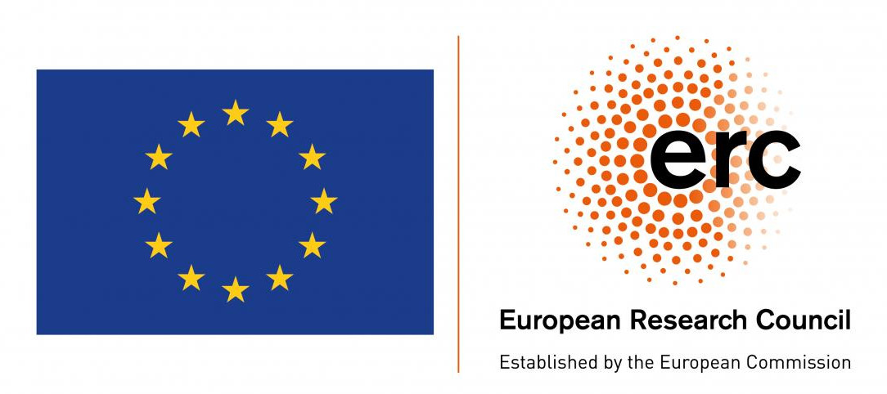

# REScala
{: class="rescala-logo"}

REScala is a Scala library for functional reactive programming on the JVM and the Web.
It provides a rich API for event stream transformations and signal composition
with managed consistent up-to-date state and minimal syntactic overhead.
It supports concurrent and distributed programs.

<!--  -->

## Flexible

Abstractions for Events and Signals. Integrating with imperative, object-oriented, functional and any other paradigm on the JVM.

## Consistent

No temporary inconsistencies, no data races, no surprises.
Write code which behaves as expected.

## Thread-safe

Multi-threaded applications are fully supported.
Reactive abstractions can be safely accessed from any thread and they are updated in parallel.

Visit the <a href="{{ site.github.baseurl }}/manual" class="alert-link">manual</a> to get started.
{: class="alert alert-info" role="alert"}

## Project Description

Software applications react to external changes such as the input from the user and network messages.
Traditionally, object-oriented software adopts the Observer pattern to implement reactivity and decouple the observers from the observables.
Whereas researchers have highlighted the drawbacks of this style for a long time, alternatives struggle to be widely accepted.
In particular, functional reactive programming and dataflow programming – which aim to represent time-changing values as first class abstractions – are promising,
but hardly escape the functional setting. On the other hand, event-based languages directly support events but do not achieve the declarative style of more functional approaches.

REScala is a reactive language which integrates concepts from event-based and functional-reactive programming into the object-oriented world.
Rescala supports the development of reactive applications by fostering a functional and declarative style which complements the advantages of object-oriented design.

# Contributors

**Project lead:**

* [Mira Mezini](http://www.stg.tu-darmstadt.de/staff/mira_mezini/)
* [Guido Salvaneschi](http://www.guidosalvaneschi.com)

**Doctoral students:**

* Ragnar Mogk
* Joscha Drechsler
* Pascal Weisenburger
* David Richter

**Bachelor and master students:**

Markus Hauck, Gerold Hintz, Przemyslaw Chrzastowski, Johannes Späth, Florian Mladitsch, Yannick Schroecker, Michael Hausl, Moritz Lichter, Simon Sprankel, Nico Ritschel, Julian Haas, Alexander Kopp, Isabella Dix, Sören Albrecht, Christian Volk, Andre Pacak.

# Impressum

Prof. Dr. Ing. Guido Salvaneschi  
salvaneschi   AT    st.informatik.tu-darmstadt.de  

Technische Universität Darmstadt  
S2|02 A222 Hochschulstr. 10 64289 Darmstadt  
+49 6151 16-5306  
+49 6151 16-5410  

# Project Funding

{: style="padding:0"}
{: class="col-sm-4"}

This project has received funding from the European Research Council (ERC) under the European Union´s Horizon 2020 research and in
novation programme (grant agreement No 862535).
{: class="col-sm-8"}

