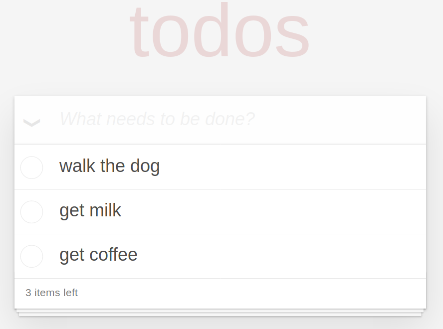

# Projects

This page collects experimental projects and research prototypes based on or inspired by REScala. For the related publications, please see the [publications](publications) page.

## [Distributed REScala](distributed)

[Distributed REScala](distributed) is the first language to bring Reactive Programming to the distributed setting. Its propagation algorithm SID-UP ensures glitch freedom in (distributed) value updates.
[**More...**](distributed)

## Concurrent Reactive Programming

We propose a model for thread-safe reactive programming that ensures abort-free strict serializability under concurrency without sacrificing neither expressiveness nor consistency. We also propose an architecture for integrating a corresponding scheduler into the RP language runtime, such that thread-safety is provided "out-of-the-box" to the applications.
We show the feasibility of our proposal by providing and evaluating a ready-to-use implementation integrated into REScala.

## [Debugging Reactive Programming](https://guidosalva.github.io/reactive-inspector/)

The reactive style requires a paradigm shift in the concepts needed for debugging, from imperative debugging to declarative debugging. Reactive Inspector is a such a debugger integrated with the Eclipse Scala IDE. It provides a number of features including visualizing reactive trees, back-in-time debugging, interactive queries of the graph, node breackpoiting and profiling.
[**More...**](https://guidosalva.github.io/reactive-inspector/)

## [Case studies](studies)

A portfolio of case studies that compare various design solutions including REScala, event-only implementations, signal-only implementations and callback-based versions.
[**More...**](studies)

## [Todolist](todolist)

A case study that implements the popular TodoMVC application (an application to maintain a simple todolist), that is implemented in many web frameworks to compare them.
[**More...**](todolist)

## [The RESwing GUI Library](reswing)

A GUI library based on the Swing Java library which provides bindings for REScala i.e., the widgets expose reactive abstractions (signals and events) to the rest of the application.
[**More...**](reswing)

## [Reactive Datastructures](datastructures)

A library of data structures base on REScala which enforce data dependencies among containers in the style of view maintenance in databases.
[**More...**](datastructures)

